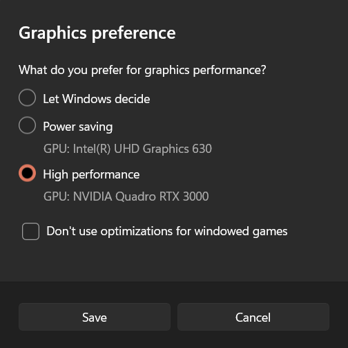

# Code Base 
This repository contains the code to our research on developing a novel method for 4D Gaussian Splatting. The code is based on and adapted from the official implementation of the paper "3D Gaussian Splatting for Real-Time Radiance Field Rendering", which can be found [here](https://repo-sam.inria.fr/fungraph/3d-gaussian-splatting/). 

# Multi-Optimizer and Differential Batch Processing 4D Gaussian Splatting
Abstract: *We propose a scalable training method for full scene Dynamic Gaussian Splatting that significantly reduces memory usage and storage footprint while maintaining high visual fidelity and scene flexibility. Our pipeline introduces a batch-wise differential training and per-frame storage using standard PLY files. We demonstrate training and real-time rendering of arbitrarily long dynamic sequences on consumer-grade GPUs, with average file sizes below 1MB per frame and GPU memory usage below 7.6GB. Furthermore, this approach introduces the ability to handle growing and emerging objects throughout the sequence. Our method aims to support researchers by making volumetric video using Gaussian Splatting more accessible to users with consumer grade hardware, and simplify the integration into existing third party Gaussian Splatting applications.*

### Setup

#### Install 3D Gaussian Splatting
Please refer to the install instructions of the 3D Gaussian Splatting implementations on [https://github.com/graphdeco-inria/gaussian-splatting](https://github.com/graphdeco-inria/gaussian-splatting).

#### Additional Setup

Following the 3DGS install please install the missing requirements from the requirements.txt:
```shell
pip install -r requirements.txt
```

### Running

To run the optimizer, simply use

```shell
python train.py -s <path to COLMAP dataset> -m <path to result directory>
```

To view the optimization progress, start the SIBR viewer in a new terminal"

```shell
"./viewers/bin/SIBR_remoteGaussian_app.exe" --ip 127.0.0.1 --port 6009
```

### Viewing of Trained Sequences
To load and view readily trained sequences use the viewer script:
```shell
python viewer4D.py --source_path <path to frame files>
```
then start the SIBR viewer:
```shell
"./viewers/bin/SIBR_remoteGaussian_app.exe" --ip 127.0.0.1 --port 6009
```

https://github.com/Prof-it/differential_4DGS/blob/main/media/Demo.mp4

## SIBR Viewer Setup
For the SIBR Viewer Setup please refer to the following instructions by the GRAPHDECO group:

Viewing solutions are based on the [SIBR](https://sibr.gitlabpages.inria.fr/) framework, developed by the GRAPHDECO group for several novel-view synthesis projects.

### Hardware Requirements
- OpenGL 4.5-ready GPU and drivers (or latest MESA software)
- 4 GB VRAM recommended
- CUDA-ready GPU with Compute Capability 7.0+ (only for Real-Time Viewer)

### Software Requirements
- Visual Studio or g++, **not Clang** (we used Visual Studio 2019 for Windows)
- CUDA SDK 11, install *after* Visual Studio (we used 11.8)
- CMake (recent version, we used 3.24)
- 7zip (only on Windows)

### Pre-built Windows Binaries
We provide pre-built binaries for Windows [here](https://repo-sam.inria.fr/fungraph/3d-gaussian-splatting/binaries/viewers.zip). We recommend using them on Windows for an efficient setup, since the building of SIBR involves several external dependencies that must be downloaded and compiled on-the-fly.

### Installation from Source
If you cloned with submodules (e.g., using ```--recursive```), the source code for the viewers is found in ```SIBR_viewers```. The network viewer runs within the SIBR framework for Image-based Rendering applications.

#### Windows
CMake should take care of your dependencies.
```shell
cd SIBR_viewers
cmake -Bbuild .
cmake --build build --target install --config RelWithDebInfo
```
You may specify a different configuration, e.g. ```Debug``` if you need more control during development.

#### Ubuntu 22.04
You will need to install a few dependencies before running the project setup.
```shell
# Dependencies
sudo apt install -y libglew-dev libassimp-dev libboost-all-dev libgtk-3-dev libopencv-dev libglfw3-dev libavdevice-dev libavcodec-dev libeigen3-dev libxxf86vm-dev libembree-dev
# Project setup
cd SIBR_viewers
cmake -Bbuild . -DCMAKE_BUILD_TYPE=Release # add -G Ninja to build faster
cmake --build build -j24 --target install
``` 

#### Ubuntu 20.04
Backwards compatibility with Focal Fossa is not fully tested, but building SIBR with CMake should still work after invoking
```shell
git checkout fossa_compatibility
```

### Navigation in SIBR Viewers
The SIBR interface provides several methods of navigating the scene. By default, you will be started with an FPS navigator, which you can control with ```W, A, S, D, Q, E``` for camera translation and ```I, K, J, L, U, O``` for rotation. Alternatively, you may want to use a Trackball-style navigator (select from the floating menu). You can also snap to a camera from the data set with the ```Snap to``` button or find the closest camera with ```Snap to closest```. The floating menues also allow you to change the navigation speed. You can use the ```Scaling Modifier``` to control the size of the displayed Gaussians, or show the initial point cloud.

### Running the Network Viewer


https://github.com/graphdeco-inria/gaussian-splatting/assets/40643808/90a2e4d3-cf2e-4633-b35f-bfe284e28ff7


After extracting or installing the viewers, you may run the compiled ```SIBR_remoteGaussian_app[_config]``` app in ```<SIBR install dir>/bin```, e.g.: 
```shell
./<SIBR install dir>/bin/SIBR_remoteGaussian_app
```
The network viewer allows you to connect to a running training process on the same or a different machine. If you are training on the same machine and OS, no command line parameters should be required: the optimizer communicates the location of the training data to the network viewer. By default, optimizer and network viewer will try to establish a connection on **localhost** on port **6009**. You can change this behavior by providing matching ```--ip``` and ```--port``` parameters to both the optimizer and the network viewer. If for some reason the path used by the optimizer to find the training data is not reachable by the network viewer (e.g., due to them running on different (virtual) machines), you may specify an override location to the viewer by using ```-s <source path>```. 

<details>
<summary><span style="font-weight: bold;">Primary Command Line Arguments for Network Viewer</span></summary>

  #### --path / -s
  Argument to override model's path to source dataset.
  #### --ip
  IP to use for connection to a running training script.
  #### --port
  Port to use for connection to a running training script. 
  #### --rendering-size 
  Takes two space separated numbers to define the resolution at which network rendering occurs, ```1200``` width by default.
  Note that to enforce an aspect that differs from the input images, you need ```--force-aspect-ratio``` too.
  #### --load_images
  Flag to load source dataset images to be displayed in the top view for each camera.
</details>
<br>

### Running the Real-Time Viewer


https://github.com/graphdeco-inria/gaussian-splatting/assets/40643808/0940547f-1d82-4c2f-a616-44eabbf0f816


After extracting or installing the viewers, you may run the compiled ```SIBR_gaussianViewer_app[_config]``` app in ```<SIBR install dir>/bin```, e.g.: 
```shell
./<SIBR install dir>/bin/SIBR_gaussianViewer_app -m <path to trained model>
```

It should suffice to provide the ```-m``` parameter pointing to a trained model directory. Alternatively, you can specify an override location for training input data using ```-s```. To use a specific resolution other than the auto-chosen one, specify ```--rendering-size <width> <height>```. Combine it with ```--force-aspect-ratio``` if you want the exact resolution and don't mind image distortion. 

**To unlock the full frame rate, please disable V-Sync on your machine and also in the application (Menu &rarr; Display). In a multi-GPU system (e.g., laptop) your OpenGL/Display GPU should be the same as your CUDA GPU (e.g., by setting the application's GPU preference on Windows, see below) for maximum performance.**



In addition to the initial point cloud and the splats, you also have the option to visualize the Gaussians by rendering them as ellipsoids from the floating menu.
SIBR has many other functionalities, please see the [documentation](https://sibr.gitlabpages.inria.fr/) for more details on the viewer, navigation options etc. There is also a Top View (available from the menu) that shows the placement of the input cameras and the original SfM point cloud; please note that Top View slows rendering when enabled. The real-time viewer also uses slightly more aggressive, fast culling, which can be toggled in the floating menu. If you ever encounter an issue that can be solved by turning fast culling off, please let us know.

<details>
<summary><span style="font-weight: bold;">Primary Command Line Arguments for Real-Time Viewer</span></summary>

  #### --model-path / -m
  Path to trained model.
  #### --iteration
  Specifies which of state to load if multiple are available. Defaults to latest available iteration.
  #### --path / -s
  Argument to override model's path to source dataset.
  #### --rendering-size 
  Takes two space separated numbers to define the resolution at which real-time rendering occurs, ```1200``` width by default. Note that to enforce an aspect that differs from the input images, you need ```--force-aspect-ratio``` too.
  #### --load_images
  Flag to load source dataset images to be displayed in the top view for each camera.
  #### --device
  Index of CUDA device to use for rasterization if multiple are available, ```0``` by default.
  #### --no_interop
  Disables CUDA/GL interop forcibly. Use on systems that may not behave according to spec (e.g., WSL2 with MESA GL 4.5 software rendering).
</details>
<br>

## Processing your own Scenes

Please Install COLMAP onto your system.

Then you can simply run sychvideos.py pointing to the directory containing the source videos of all cameras:
```shell
python synchvideos.py --videosdir <directory containing source videos> --referencevideo <path to referencevideo> --targetdir <path to target directory>
```
<details>
<summary><span style="font-weight: bold;">Command Line Arguments for synchvideos.py</span></summary>
  
  #### --videosdir
  Path to directory containing source videos.
  #### --referencevideo
  Path to referencevideo.
  #### --framestart
  Frame to start synching from. Default: 0
  #### --endframe
  Frame to trim the videos to. Default: 100
  #### --framerate
  Framerate of recorded videos. Default: 30
  #### --fileformat
  Fileformat of the recorded videos (MP4, MOV, etc). Default: MOV
  #### --downscale
  Flag to downscale extracted images. Default: False
  #### --skipsync
  Flag to skip synching process if videos are already synched. Default: False
</details>
